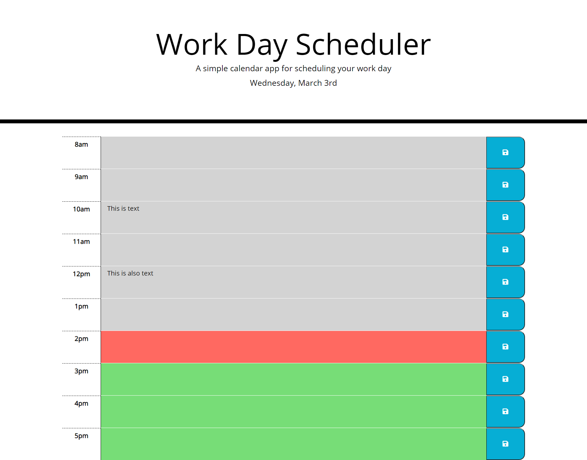

# Work Day Scheduler <!-- omit in toc -->
- [Description](#description)
- [Demo](#demo)
- [Submission Requirements](#submission-requirements)
  - [User Story](#user-story)
  - [Acceptance Criteria](#acceptance-criteria)
  - [Grading Criteria](#grading-criteria)
## Description
For this project, I was tasked with creating a work day scheduler. The scheduler shows hours of the work day and allows users to enter tasks into a text area as well as save those tasks so they persist upon refreshing the webpage.

I was able to complete the challenge assignment by utilizing third-party-APIs to do a lot of the heavy lifting. 
* Bootstrap provided much of the styling for the time block section of the webpage, specifically the grid for the position formatting
* Moment.js was a great tool for parsing and comparing date/time values
* JQuery was invaluable for dynamically changing styles of elements, adding and removing parts of elements, and handling listeners

While the functionality of the application is fairly simple, creating the javascript logic by hand proved to be quite a challenge for myself. I found myself contantly looking at the module assignment to get clues as to how to proceed. Once I was able to get my bearings, however, I was more comfortable with looking at web documentation instead of my old assignment for guidance. This allowed me to deviate from my previous assignment and find the specific answers I needed rather than having to contextualize my old assignment to this new one.
## Demo
A live version of the deployed application can be found [here](https://glendonintendo.github.io/challenge5-work-day-scheduler/).

An image of the launched application can also be found below: 
## Submission Requirements
### User Story
```
AS AN employee with a busy schedule
I WANT to add important events to a daily planner
SO THAT I can manage my time effectively
```
### Acceptance Criteria
```
GIVEN I am using a daily planner to create a schedule
WHEN I open the planner
THEN the current day is displayed at the top of the calendar
WHEN I scroll down
THEN I am presented with time blocks for standard business hours
WHEN I view the time blocks for that day
THEN each time block is color-coded to indicate whether it is in the past, present, or future
WHEN I click into a time block
THEN I can enter an event
WHEN I click the save button for that time block
THEN the text for that event is saved in local storage
WHEN I refresh the page
THEN the saved events persist
```
### Grading Criteria
#### Technical Acceptance Criteria: 40% <!-- omit in toc -->
- [x] Current day is displayed at the top of the web page
- [x] Page contains time blocks for standard business hours
- [x] Time blocks will color code by past, present, future
- [x] Time blocks can be edited with text content when clicked
- [x] Contents of time blocks are saved in local storage
- [x] Events saved in local storage populate the page when refreshed
- [x] Uses Moment.js library to work with date and time
#### Deployment: 32% <!-- omit in toc -->
- [x] Application deployed at live URL
- [x] Application loads with no errors
- [x] Application GitHub URL submitted
- [x] GitHub repo contains application code
#### Application Quality: 15% <!-- omit in toc -->
- [x] Application user experience is intuitive and easy to navigate
- [x] Application user interface style is clean and polished
- [x] Application resembles the mock-up functionality
#### Repository Quality: 13% <!-- omit in toc -->
- [x] Repository has a unique name
- [x] Repository follows best practices for file structure and naming conventions
- [x] Repository follows best practices for class/id naming conventions, indentation, quality comments, etc.
- [x] Repository contains multiple descriptive commit messages
- [x] Repository contains quality README file with description, screenshot and link to deployed application